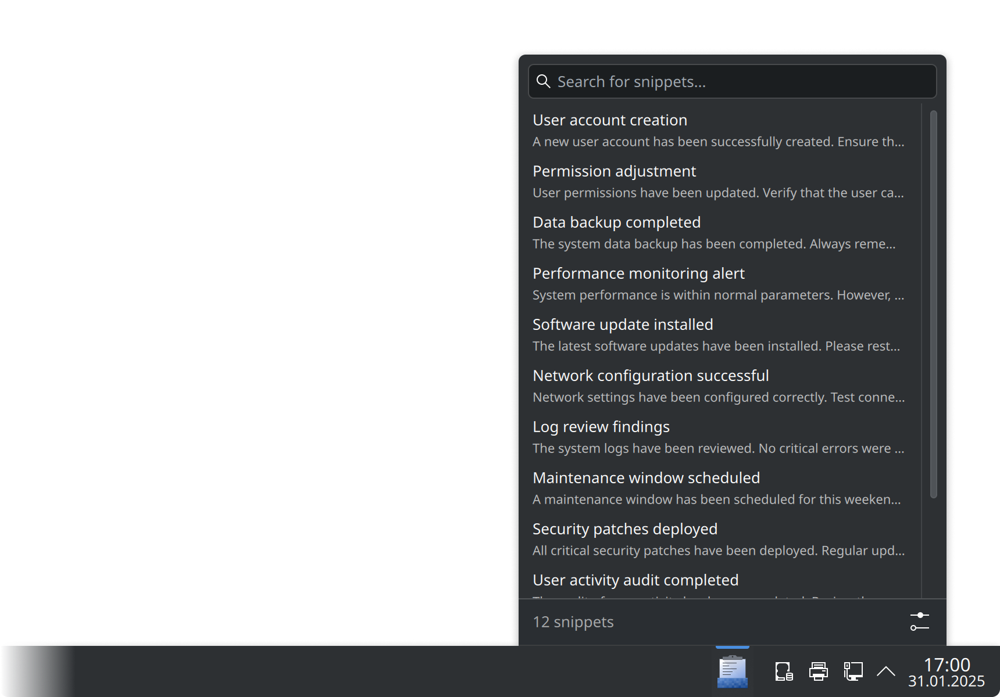

# Kopypast

_Kopypast_ is a KDE Plasma applet for quick interaction with text snippets.

## Building from source

The recommended method is to use KPackage Manager:

1. Install the package that provides the `kpackagetool6` command in your distribution.
2. Clone `https://github.com/vmkspv/kopypast.git` repository and `cd kopypast`.
3. Run `kpackagetool6 -t Plasma/Applet --install package` command.

After installation, the applet should be available to add to your Plasma panels/desktop via the widget browser.

To update an existing installation, use `--upgrade` instead of `--install`.

## Contributing

Contributions are welcome!

If you have an idea, bug report or something else, don’t hesitate to [open an issue](https://github.com/vmkspv/kopypast/issues).

> This project follows the [KDE Community Code of Conduct](https://kde.org/code-of-conduct).

## License

Kopypast is released under the [GPL-3.0 license](COPYING).
